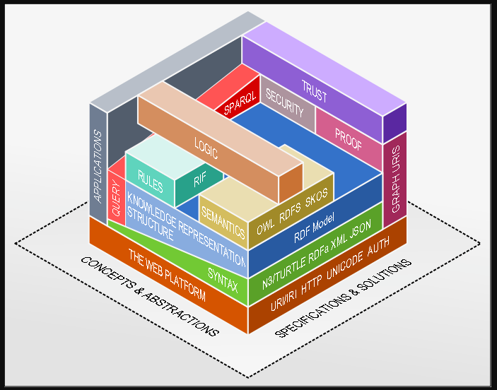

# Introdução

O Elucidário.art é um Sistema de Gestão de Coleções com foco em Coleções de Artes Mistas, ou seja, artes-visuais, artefatos, itens religiosos e arte decorativa.

Quando pensamos na Informação Museológica, a primeira e mais óbvia imagem que temos são dos objetos expostos ou armazenados em um museu, ou *musealia*: objetos que tem valor artístico, cultural, ou histórico atribuído ou reconhecido ao longo de sua existência. Mas esta é só a ponta do iceberg. Um objeto foi criado por alguém, em algum lugar, e em determinado momento do tempo. Passou por transformações, pessoas e organizações: pode ter sido destruído, roubado, restaurado ou recuperado. Na cultura material um objeto conta a história do patrimônio cultural e artístico da humanidade, e todos estes processos e procedimentos geram informação e conhecimento que precisam ser armazenados, organizados e distribuídos.

## Conceitos fundamentais

## Web Semântica e suas tecnologias

- <https://ceweb.br/noticia/notas/web-semantica-para-desenvolvedores-por-onde-comecar/>
- <https://www.youtube.com/watch?v=4x_xzT5eF5Q>
- <https://www.youtube.com/watch?v=ldl0m-5zLz4>
- <https://www.youtube.com/watch?v=vioCbTo3C-4>

## Linked-data

- <https://www.w3.org/DesignIssues/LinkedData>
- <https://en.wikipedia.org/wiki/Linked_data>
- <https://www.w3.org/wiki/LinkedData>

## Json-ld

- <https://json-ld.org>

## JSON-Schema

- <https://json-schema.org>
- <https://www.jsonschemavalidator.net>
- <https://ajv.js.org>
- <https://www.youtube.com/watch?v=JpzH8Eq663o>
- <https://youtu.be/dtLl37W68g8?si=gR0i7H7LYnByGSSs>

## Linked-art

- <https://linked.art>
- <https://youtu.be/lDbasKNtWM8?si=PNnvb237lfQRvCve> * ESSE AQUI VALE MTO A PENA E É BEM IMPORTANTE!

## Ferramentas de Documentação

### Tesauro

- <https://pt.wikipedia.org/wiki/Tesauro>
- <https://youtu.be/_lym0nD2-h8?si=7fxF69jHVjzPk4Im>
- <https://eooci.uff.br/classificacao-tesauro-e-terminologia/>
- <https://www.getty.edu/research/tools/vocabularies/index.html>

### Ontologia

- <https://pt.wikipedia.org/wiki/Ontologia>
- <https://pt.wikipedia.org/wiki/Ontologia_(ci%C3%AAncia_da_computa%C3%A7%C3%A3o)>
-
