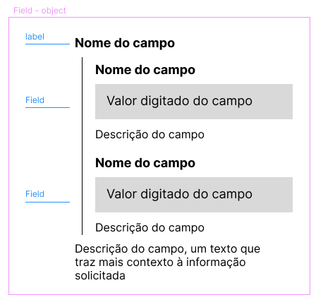
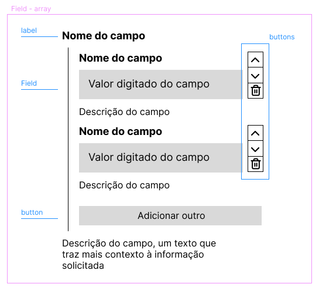

### 7.1.2 @elucidario/pkg-design-system

**Escopo**

O _Design System_ ou Sistema de Design (SD) do Elucidário.art consiste em um conjunto de regras, definições, padrões de design e bibliotecas de componentes utilizados para construir a identidade visual e as interfaces de usuário do plugin. Nele definimos fontes, cores, padrões, espaçamentos, alinhamentos, layouts, etc. O SD é utilizado para construir a interface de administração do plugin, acessível para o usuário logado e com permissão para visualização e edição.

**Descrição**

Os conjuntos de regras e definições delimitam o design em padrões consistentes para reutilização ao longo de toda a aplicação, nele definimos fontes, cores, espaçamentos, tamanhos, alinhamentos, etc, juntamente com as bibliotecas de componentes que são conjuntos de componentes React que podem ser utilizados para construir as interfaces de usuário do plugin. Os componentes são construídos utilizando o padrão de design definido no SD, dessa forma conseguimos garantir a consistência do design ao longo da aplicação, além de facilitar a manutenção e a criação de novos componentes.

Todas as dependências do Elucidário.art são open-source, assim como a fonte utilizada, a Inter  [@andersson2021] desenvolvida para uso em telas.

{{count:figures;legend=Fonte Inter.}}

Como vimos no "@elucidario/pkg-mdorim", os metadados do modelo são descritos em JSON-Schema que estipula sete tipos de dados primitivos:

1. `string` - sequência de caracteres;
2. `null` - valor nulo;
3. `number` - número;
4. `integer` - número inteiro;
5. `boolean` - valor booleano, true ou false, 1 ou 0;
6. `array` - lista de valores;
7. `object` - objeto JSON.

Para a definição do SD utilizaremos o mesmo formato definido no Mdorim com algumas camadas extras para melhorar a experiência de desenvolvimento. Sendo uma delas o mapeamento entre os tipos de dados primitivos e tags HTML com seus atributos. Para componentes mais complexos, como `array` desenvolvemos um componente React exclusivo que permite a adição, remoção e reordenação de itens. O quadro a seguir descreve o mapeamento realizado, em que "schema type" é o tipo de dado definido no JSON-Schema; "schema format" representa o formato de dado de uma string no JSON-Schema; "schema extra" representa qualquer outra propriedade do vocabulário JSON-Schema; "html tag" é a tag html relacionada no mapeamento, pode vir acompanhada de um sinal ">" representando uma hierarquia entre tags html ou componentes React; "input type" é o tipo de input HTML utilizado; "attributes" são os atributos da tag html; "descrição" é uma breve descrição do mapeamento realizado.

{{table:elucidario/design-system/json-schema-html.json}}

Criamos um componente chamado `Field`, construído a partir da tag `fieldset` do HTML, este componente agrega e padroniza todos os requisitos para o devido funcionamento de um componente de formulário React, e utiliza os mapeamentos descritos anteriormente para renderizar a UI. O componente `Field` resolve os seguintes requisitos:

- nome do campo;
- descrição;
- validação de dados:
- feedback de validação;
- a11y (acessibilidade):
- contraste de cores;
- navegação por teclado;
- WAI-ARIA;
- i18n (internacionalização):
- tradução de textos;
- tradução de mensagens de erro;

Podemos representar a anatomia do componente `Field` da seguinte forma:

**{{count:figures;legend=Anatomia do componente "Field".}}**

Para a validação de dados, além do feedback visual é necessário que o _Field_ informe ao usuário a mensagem da validação, seja sucesso ou erro:

**{{count:figures;legend=Feedback de erro do componente "Field".}}**

**{{count:figures;legend=Feedback de sucesso do componente "Field".}}**

No caso de `object` o _Field_ é capaz de aninhar outros _Fields_:

**{{count:figures;legend=Anatomia do componente "Field" com "object".}}**

Assim como o `array` é capaz de adicionar, remover e reordenar _Fields_:

**{{count:figures;legend=Anatomia do componente "Field" com "array".}}**

